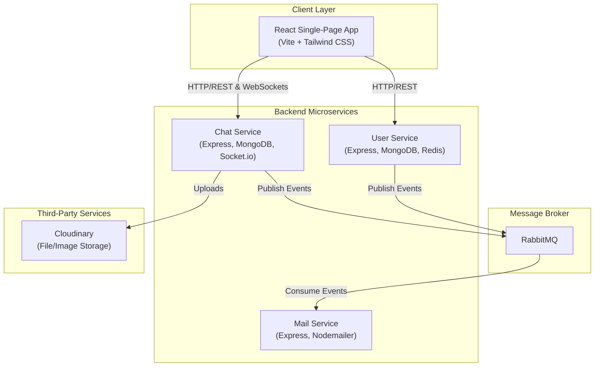

# Kove 💬

**Kove: A Next-Generation Real-Time Communication Platform**

_Engineered for high-availability and instantaneous interaction, Kove provides a robust, distributed backend and a fluid user experience for modern chat applications._

[]() []() []() []() []() []() []() []()

## 🎯 Problem & Solution Framing

### Problem 1: The Monolithic Trap

For real-time applications, monolithic backends inevitably lead to bottlenecks. As user load increases, features become tightly coupled, making maintenance difficult, deployments risky, and scaling a significant challenge. A single point of failure can bring the entire system down, compromising reliability.

**Solution: A Distributed & Resilient Backbone**
Kove avoids the monolithic trap by implementing a **fully distributed microservices architecture**. The backend is intelligently decoupled into independent **User, Chat, and Mail services**. This design ensures high availability and fault tolerance. Services communicate asynchronously via a **RabbitMQ event bus**, allowing for seamless, independent scaling and updates without system-wide downtime.

### Problem 2: The Latency Chasm in User Experience

Modern users expect instantaneous interaction. Traditional HTTP polling methods are inefficient and resource-intensive, creating a noticeable lag that degrades the user experience and breaks the feeling of a live, fluid conversation.

**Solution: The Real-Time WebSocket Engine**
Kove closes the latency chasm with a powerful **WebSocket-based communication engine** powered by `Socket.io`. This establishes a persistent, bidirectional channel between the client and server, enabling messages and presence updates to be delivered with near-zero latency. The result is a fluid, truly real-time conversation experience that users can rely on.

### Problem 3: Unreliable Background Processing

Critical but slow operations, like sending verification emails, can make APIs sluggish and prone to failure if handled synchronously. A transient network error during an API call could lead to a failed user action and a poor user experience.

**Solution: A Resilient, Asynchronous Task Queue**
Kove decouples these processes using a **robust event bus**. When a user requires an OTP, the API provides an immediate response while publishing an event to a **RabbitMQ** queue. The **Mail Service** consumes these events independently and includes **built-in retry logic**, ensuring that emails are sent reliably even if transient failures occur.

### Problem 4: Insecure and Centralized Asset Management

Storing user-uploaded assets (images, files) on the same server that runs the application logic is inefficient and insecure. It increases server load, complicates scaling, and exposes the core application server to potential security risks associated with file handling.

**Solution: Offloaded, Secure Media Distribution**
Kove delegates all media handling to a specialized, secure cloud service. All file uploads are streamed directly to **Cloudinary**, which provides a robust API for asset management and a global **Content Delivery Network (CDN)** for fast, edge-cached delivery. This offloading strategy drastically reduces the load on Kove's core services and enhances security.

## System Design & Philosophy

- **Service-Oriented & Decoupled:** The system is fundamentally designed around Separation of Concerns. The backend is decomposed into microservices with single responsibilities (User, Chat, Mail), each owning its data and logic to improve maintainability and enable independent deployments.
- **Stateless & Scalable by Design:** Backend services are stateless, relying on JWT for authorization and externalizing state to MongoDB and Redis. This is critical for horizontal scalability, allowing multiple instances of any service to run behind a load balancer without session-related complications.
- **Asynchronous & Event-Driven:** Inter-service communication is primarily asynchronous using a RabbitMQ event bus. This non-blocking paradigm decouples services, improves fault tolerance, and allows for resilient background job processing (e.g., email notifications) without impacting core API performance.
- **Security as a Foundation:** The architecture is built with a defense-in-depth approach. This includes cryptographic hashing for passwords (bcrypt), JWT-secured endpoints, API rate-limiting via Redis, and strict separation of secrets into environment variables.

## Engineering Deep Dive

### 1. Stateless JWT-Based Authentication

The **User Service** acts as the central authentication authority. It offers both password-based and passwordless (OTP) login flows.

- **Secure Credentials:** User passwords are never stored in plaintext. They are cryptographically secured using the industry-standard **bcrypt** hashing algorithm.
- **Token-Based Security:** Upon successful login, a stateless **JSON Web Token (JWT)** is minted and signed with a server-side secret. This token is used to authenticate subsequent requests across the entire distributed system.
- **Performance & Abuse Prevention:** **Redis** is leveraged for performance and security. It stores OTPs with a 5-minute TTL and enforces a 60-second rate limit on OTP generation to prevent email spam and service abuse.

### 2. Real-Time WebSocket Messaging Layer

The **Chat Service** is the heart of the real-time functionality.

- **Authenticated Connections:** Every WebSocket connection is individually authenticated via a JWT passed during the initial handshake, ensuring that only valid, logged-in users can establish a persistent connection.
- **Rich Interaction Model:** It uses **Socket.io** to manage persistent connections and provides a rich, real-time experience beyond simple messaging, handling events like `join_room`, `leave_room`, `typing`, and `stop_typing` to create a dynamic user experience.

### 3. Resilient Asynchronous Event Bus

**RabbitMQ** serves as the distributed system's nervous system, enabling reliable, decoupled communication.

- **Decoupled Workflow Example:** When a user requests an OTP, the User Service publishes a `send-otp` event to the queue and immediately returns a success response to the user. This non-blocking operation ensures a fast user experience.
- **Reliable Delivery:** The **Mail Service** subscribes to the `send-otp` queue. Its consumer includes an **automatic retry mechanism**, ensuring that critical tasks like sending verification emails are completed even if transient network failures occur.

### 4. Centralized Frontend State Management

The frontend avoids prop-drilling and maintains a clean architecture by using **React Context API** for global state.

- **`AuthContext`**: A global context provides authentication status, user data, and the JWT to all components in the tree. A custom `useAuth` hook offers a simple and consistent interface for components to access this shared state.

## ⚙️ System Architecture



## Technology Stack

### Core Backend

- **Node.js**: Event-driven JavaScript runtime.
- **Express.js**: Web framework for routing and middleware.
- **TypeScript**: Statically typed language for robust code.

### Database & Caching

- **MongoDB**: NoSQL document store for primary data persistence.
- **Mongoose**: Object Data Modeling (ODM) library for MongoDB.

* **Redis**: In-memory data store for caching, rate-limiting, and OTP management.

### Messaging & Real-Time

- **RabbitMQ / amqplib**: High-performance message broker for inter-service communication.
- **Socket.io**: Real-time engine for WebSocket-based communication.

### Security

- **JWT (jsonwebtoken)**: For secure, stateless authentication.
- **Bcrypt**: For robust password hashing.

### Frontend

- **React**: A JavaScript library for building interactive user interfaces.
- **Vite**: Next-generation frontend tooling with native ES modules support.
- **Tailwind CSS**: Utility-first CSS framework for rapid UI development.
- **shadcn/ui**: Re-usable components built using Radix UI and Tailwind CSS.
- **React Router DOM**: For seamless client-side routing.
- **Axios**: Promise-based HTTP client for reliable API communication.

## 🚀 Getting Started

Follow these instructions to set up the Kove project in a local development environment.

### Prerequisites

- **Node.js** (v18 or higher) & **npm**
- **Docker**: Required for running the message broker.
- **MongoDB** instance (local or a cloud-based service like MongoDB Atlas).
- **RabbitMQ Server**: It is recommended to run RabbitMQ using Docker. You can start a container with the management plugin using the command below:
  ```sh
  docker run -d --hostname my-rabbit --name kove-rabbit -p 5672:5672 -p 15672:15672 rabbitmq:3-management
  ```
- **Redis** server (local or cloud-based).
- **Cloudinary** account credentials.

### 🛠️ Installation & Setup

1.  **Clone the Repository**

    ```sh
    git clone <your-repo-url>
    cd Kove
    ```

2.  **Backend Services Setup**

    For each service (`backend/user`, `backend/chat`, `backend/mail`):
    a. Navigate into the service directory: `cd backend/<service-name>`
    b. Install dependencies: `npm install`
    c. Create an environment file from the sample: `cp .env.sample .env`
    d. Populate the new `.env` file with your credentials.

3.  **Frontend Setup**
    a. Navigate into the frontend directory: `cd frontend`
    b. Install dependencies: `npm install`
    c. Start the development server: `npm run dev`

    The frontend application will be accessible at `http://localhost:5173`.

### Running the Application

After setting up the environment variables for all services:

1.  **Start each backend service:**
    From each service's directory (`backend/user`, `backend/chat`, `backend/mail`), run:

    ```sh
    npm run build
    npm start
    ```

    Ensure all three services are running concurrently.

2.  **Start the frontend:**
    From the `frontend` directory, run:
    ```sh
    npm run dev
    ```

## 🤝 Contribution Workflow

We welcome and encourage community contributions. Please adhere to the following workflow:

1.  **Fork the Repository**: Start by forking the main Kove repository to your own GitHub account.
2.  **Create a Feature Branch**: Create a new branch for your work. Use a descriptive name.
    ```sh
    git checkout -b feature/MyAmazingFeature
    ```
3.  **Commit Your Changes**: Make your changes and commit them with clear, descriptive commit messages.
    ```sh
    git commit -m 'feat: Implement MyAmazingFeature'
    ```
4.  **Push to Your Branch**: Push your changes up to your forked repository.
    ```sh
    git push origin feature/MyAmazingFeature
    ```
5.  **Submit a Pull Request**: Open a pull request from your feature branch to the `main` branch of the original Kove repository. Provide a detailed description of your changes.

---

## Contact

**Developer:** Parth Ahuja  
**GitHub:** [@ParthAhuja4](https://github.com/ParthAhuja4)  
**Email:** [parthahuja006@gmail.com](mailto:parthahuja006@gmail.com)
**Linked In:** [Parth Ahuja](https://www.linkedin.com/in/parthahuja4/)
